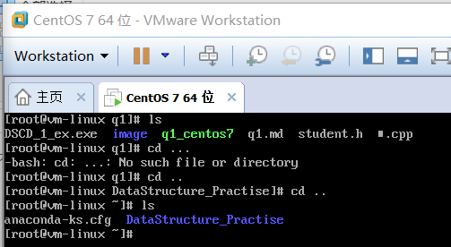
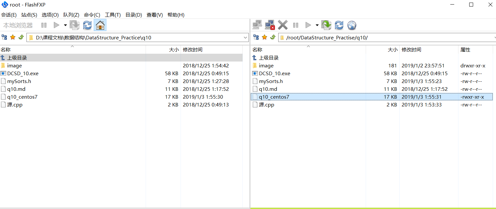
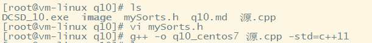
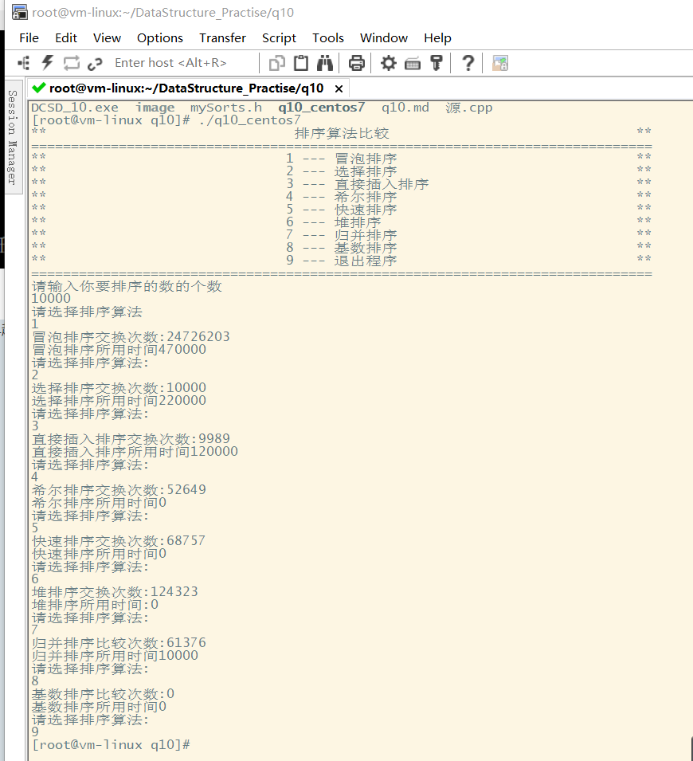

## CentOS7下编译数据说明
 每个问题文件夹中都有一个以'_CentOS7'为终结的文件,是在CentOS7下编译cpp产生的可执行文件
 现举q10为例简要说明编译步骤:
 ###  1.传输文件
 打开我的CentOS7虚拟机,新建DataStructure_Practise目录
 

 用FlashFXP将Windows下相关代码文件传到DataStructure_Practise目录



 ### 编译文件
 进入相关目录 使用g++编译
 具体命令
  g++ -o q10_centos7 源.cpp -std=c++11


### 运行可执行文件
具体命令
 ./q10_centos7


### 其余题目类似
 注意由于g++和vs在编译上有所区别,所以Windows下的代码在CentOS7编译前经过一些微小变动使之适应编译,其中所有文件都注释掉了```c++ system("pause"); ```,其他变化会列明在每个项目的md中