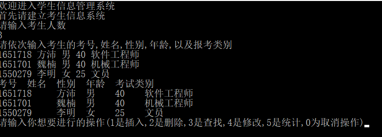
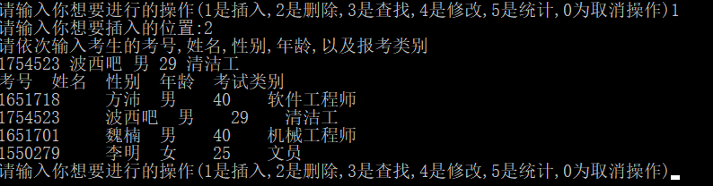
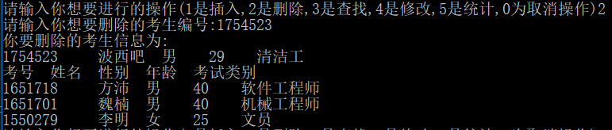
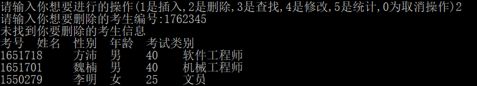
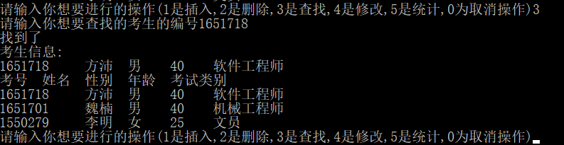
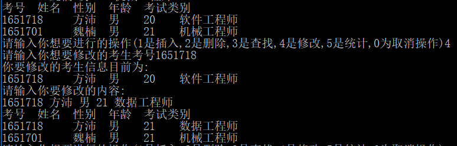
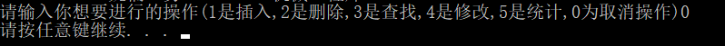
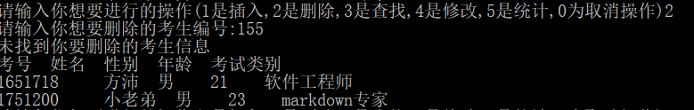
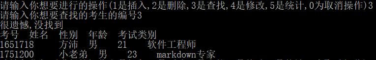
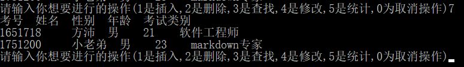

# 数据结构课程设计

#### 作者：1651718 方沛

[TOC]


## 考试报名系统项目说明文档

### 0.项目简介

 考试报名工作给各高校报名工作带来了新的挑战，给教务管理部门增加了很大的工作量。本项目是对考试报名管理的简单模拟，用控制台选项的选择方式完成下列功能：输入考生信息；输出考生信息；查询考生信息；添加考生信息；修改考生信息；删除考生信息。

- 项目功能要求：

本项目的实质是完成对考生信息的建立，查找，插入，修改，删除等功能。其中考生信息包括准考证号，姓名，性别，年龄和报考类别等信息。项目在设计时应首先确定系统的数据结构，定义类的成员变量和成员函数；然后实现各成员函数以完成对数据操作的相应功能；最后完成主函数以验证各个成员函数的功能并得到运行结果。（建议采用链表实现）

### 1.项目实现
- 建立考生信息
```c++
istream & operator >> (istream & is, student & st) {
	string index_;
	string name_;
	string sex_;
	int age_;
	string subject_;
	is >> index_ >> name_ >> sex_ >> age_ >> subject_;
	if (is) {
		st.index = index_;
		st.name = name_;
		st.sex = sex_;
		st.age = age_;
		st.subject = subject_;
	}
	else {
		cout << "cin in bug!" << endl;
	}
	return is;
}

void ctl_part::build(int _maxStudent) {
	for (int i = 1; i <= _maxStudent; i++) {
		student temp;
		cin >> temp;
		Student_Chart.push_back(temp);
	}
}
	
```



- 插入考生信息
```c++
void ctl_part::insert(int position) {
	cout << "请依次输入考生的考号,姓名,性别,年龄,以及报考类别" << endl;
	student temp;
	cin >> temp;
	if (Student_Chart.empty()) {
		Student_Chart.push_back(temp);
	}
	else if(position!=1){
		list<student>::iterator iter = Student_Chart.begin();
		for (int i = 1; i < position&&iter != Student_Chart.end(); i++) {
			iter++;
		}
		Student_Chart.insert(iter, temp);
	}
	else if (position == 1) {
		Student_Chart.push_front(temp);
	}
}
```


- 删除考生信息
```c++
void ctl_part::rubber(string erase_index) {
	for (list<student>::iterator iter = Student_Chart.begin(); iter != Student_Chart.end(); iter++) {
		if (iter->Index() == erase_index) {
			cout << "你要删除的考生信息为:" << endl;
			cout << (*iter);
			Student_Chart.erase(iter);
			return;
		}
	}
	cout << "未找到你要删除的考生信息" << endl;
	return;
}
```






- 查找考生信息
```c++
void ctl_part::search(string search_index) {
	for (list<student>::iterator iter = Student_Chart.begin(); iter != Student_Chart.end(); iter++) {
		if (iter->Index() == search_index) {
			cout << "找到了" << endl;
			cout << "考生信息:" << endl;
			cout << (*iter);
			return;
		}
	}
	cout << "很遗憾,没找到" << endl;
	return;
}
```



- 修改考生信息
```c++
void ctl_part::change(string change_index) {
	for (list<student>::iterator iter = Student_Chart.begin(); iter != Student_Chart.end(); iter++) {
		if (iter->Index() == change_index) {
			cout << "你要修改的考生信息目前为:" << endl;
			cout << (*iter);
			student temp;
			cout << "请输入你要修改的内容:" << endl;
			cin >> temp;
			(*iter) = temp;
		}
	}
}
```



- 统计考生信息
由于word文档里没有留下相关需求,所以只保留了接口

- 取消操作
```c++
if (client_requiremnt == 0) {
			break;
}
```



### 2. 类及类成员介绍
- #### 概述
采用了数据驱动模型,定义了一个顶层类whole_system,内包含一个ctl_part用于数据的操控,render_part用于接收,类似于前端设计思想中的smart和dumb组件,用户传递的信息传入control_part使得层次清晰.

```c++
//main()部分代码,可以看出非常简洁,client_requirement接受用户请求,excute_requirement负责执行对应操作
int main() {
	whole_system stu_system;
	stu_system.start_to_build();
	while (true) {
		stu_system.display_statistics();
		int client_requiremnt = stu_system.require();
		if (client_requiremnt == 0) {
			break;
        }
		else {
			stu_system.excute_requirement(client_requiremnt);
		}
	}
	system("pause");
}
```

- #### Student类  

  - ##### 成员变量
  |成员名称|属性|类型|描述|
  |--------|---|---|----|
  |index|private|string|考号|
  |name|private|string |姓名|
  |sex|private|string |性别|
  |age|private|int |年龄|
  |subject|private|string |报考类别|


  - ##### 成员函数 (重要的) 
|函数名称|参数类型|描述|
|--------|--------|----|
|operator=|student &|重载赋值函数|
|operator>>| istream & , student & |输入学生信息|
|operator<<| ostream & , student & |输出学生信息|

- #### ctl_part类  

  - ##### 成员变量
  |成员名称|属性|类型|描述|
  |--------|---|---|----|
  |Student_Chart|private| list<student> |保存学生信息|

  - ##### 成员函数(重要的)  
  |函数名称|参数类型|描述|
  |--------|--------|----|
  |build|int|建立初始化表|
  |insert|int|插入学生|
  |rubber|string|删除学生|
  |search|string |查找学生|
  |change|string|修改学生信息|
  |display|void|显示修改后结果|

- #### render_part类  

  - ##### 成员变量
  |成员名称|属性|类型|描述|
  |:-------|---|---|----|
  |string_bar|private|string|字符串参数|
  |num_bar|private|string |整数类参数|


  - ##### 成员函数 (重要的) 
|函数名称|参数类型|描述|
|:-------|--------|----|
|build_picture| void     |获取建立人数|
|ask_requirement| void | 接受用户请求 |
|insert_picture| void     |获取插入位置|
|rubber_picture| void |获取清除编号|
|search_picture| void |获取寻找编号|
|change_picture| void |获取改变编号|

- #### whole_system类  

  - ##### 成员变量
  |成员名称|属性|类型|描述|
  |:-------|---|---|----|
  |control_panal|private| ctl_part    | 获取数据的组件 |
  |render_panal|private| render_part |处理数据的组件|


  - ##### 成员函数 (重要的) 
|函数名称|参数类型|描述|
|:-------|--------|----|
|start_to_build| void     |建立数据的获取与修改|
|start_to_insert| void | 插入数据的获取与修改 |
|start_to_rubber| void | 删除数据的获取与修改 |
|start_to_search| void |查询数据的获取与修改|
|start_to_change| void |修改数据的获取与修改|
| excute_requirement | int      | 判断执行具体操作     |

### 2. 类的实现
- #### student类的实现

```c++
class student {
private:
	string index;   //考号
	string name;   //姓名
	string sex;
	int age;   //年龄
	string subject; //报考类别
public:
	void operator=(student &st);
	student() { ; };
	string Index() { return index; };
	friend istream & operator >> (istream & is, student & st);
	friend ostream & operator << (ostream & os, student & st);
};

istream & operator >> (istream & is, student & st) {
	string index_;
	string name_;
	string sex_;
	int age_;
	string subject_;
	is >> index_ >> name_ >> sex_ >> age_ >> subject_;
	if (is) {
		st.index = index_;
		st.name = name_;
		st.sex = sex_;
		st.age = age_;
		st.subject = subject_;
	}
	else {
		cout << "cin in bug!" << endl;
	}
	return is;
}
ostream & operator <<(ostream &os, student &st) {
	os << st.index << "     " << st.name << "  " << st.sex << "    " << st.age << "    " << st.subject << endl;
	return os;
}

void student::operator=(student &st) {
	index = st.index;
	name = st.name;
	sex = st.sex;
	age = st.age;
	subject = st.subject;
}


```

- #### ctl_part类的实现
```c++
/*
用于数据操作的类
*/
class ctl_part {
private:
	list<student> Student_Chart; //表格
public:
	ctl_part() { ; };
	void build(int _maxStudent); //建立
	void insert(int position);//插入
	void rubber(string erase_index);//删除
	void search(string search_index);//搜索
	void change(string change_index);//修改
	void display();
	/*
	void sum();   //统计
	*/
};
void ctl_part::display() {
	cout << "考号" << "  " << "姓名" << "  " << "性别" << "  " << "年龄" << "  " << "考试类别" << endl;
	for (list<student>::iterator iter = Student_Chart.begin(); iter != Student_Chart.end(); iter++) {
		cout << (*iter);
	}
}
void ctl_part::build(int _maxStudent) {
	for (int i = 1; i <= _maxStudent; i++) {
		student temp;
		cin >> temp;
		Student_Chart.push_back(temp);
	}
}

void ctl_part::insert(int position) {
	cout << "请依次输入考生的考号,姓名,性别,年龄,以及报考类别" << endl;
	student temp;
	cin >> temp;
	if (Student_Chart.empty()) {
		Student_Chart.push_back(temp);
	}
	else if(position!=1){
		list<student>::iterator iter = Student_Chart.begin();
		for (int i = 1; i < position&&iter != Student_Chart.end(); i++) {
			iter++;
		}
		Student_Chart.insert(iter, temp);
	}
	else if (position == 1) {
		Student_Chart.push_front(temp);
	}
}

void ctl_part::rubber(string erase_index) {
	for (list<student>::iterator iter = Student_Chart.begin(); iter != Student_Chart.end(); iter++) {
		if (iter->Index() == erase_index) {
			cout << "你要删除的考生信息为:" << endl;
			cout << (*iter);
			Student_Chart.erase(iter);
			return;
		}
	}
	cout << "未找到你要删除的考生信息" << endl;
	return;

}

void ctl_part::search(string search_index) {
	for (list<student>::iterator iter = Student_Chart.begin(); iter != Student_Chart.end(); iter++) {
		if (iter->Index() == search_index) {
			cout << "找到了" << endl;
			cout << "考生信息:" << endl;
			cout << (*iter);
			return;
		}
	}
	cout << "很遗憾,没找到" << endl;
	return;
}
void ctl_part::change(string change_index) {
	for (list<student>::iterator iter = Student_Chart.begin(); iter != Student_Chart.end(); iter++) {
		if (iter->Index() == change_index) {
			cout << "你要修改的考生信息目前为:" << endl;
			cout << (*iter);
			student temp;
			cout << "请输入你要修改的内容:" << endl;
			cin >> temp;
			(*iter) = temp;
		}
	}
}
```
- #### render_part类的实现
```c++
/*
用于传递参数的渲染类
*/
class render_part {
private:
	string string_bar;
	int num_bar;
public:
	render_part() { ; };

	int build_picture() {
		cout << "首先请建立考生信息系统" << endl;
		cout << "请输入考生人数" << endl;
		cin >> num_bar;
		cout << "请依次输入考生的考号,姓名,性别,年龄,以及报考类别" << endl;
		return num_bar;
	}
	int ask_requirement() {
		cout << "请输入你想要进行的操作(1是插入,2是删除,3是查找,4是修改,5是统计,0为取消操作)";
		int choise = 0;
		cin >> choise;
		return choise;
	}
	int insert_picture() {
		cout << "请输入你想要插入的位置:";
		int position = 0;
		cin >> position;
		return position;
	}
	string rubber_picture() {
		cout << "请输入你想要删除的考生编号:";
		string erase_index;
		cin >> erase_index;
		return erase_index;
	}
	string search_picture() {
		cout << "请输入你想要查找的考生的编号";
		string search_index;
		cin >> search_index;
		return search_index;
	}
	string change_picture() {
		cout << "请输入你想要修改的考生考号";
		string change_index;
		cin >> change_index;
		return change_index;
	}
};

```
- #### whole_system类的实现
```c++
class whole_system {
private:
	ctl_part control_panal;
	render_part render_panal;
public:
	whole_system() { cout << "欢迎进入学生信息管理系统" << endl; };
	void display_statistics() { control_panal.display(); };
	void start_to_build();
	int require();
	void excute_requirement(int order);
	void start_to_insert();
	void start_to_rubber();
	void start_to_search();
	void start_to_change();

};

void whole_system::start_to_build() {
	/*得到要输入的学生数*/
	int maxStudent = render_panal.build_picture();
	control_panal.build(maxStudent);
}
void whole_system::start_to_insert() {
	int position = render_panal.insert_picture();
	control_panal.insert(position);
}
void whole_system::start_to_rubber() {
	string erase_index = render_panal.rubber_picture();
	control_panal.rubber(erase_index);

}

void whole_system::start_to_search() {
	string search_index = render_panal.search_picture();
	control_panal.search(search_index);
}

void whole_system::start_to_change() {
	string change_index = render_panal.change_picture();
	control_panal.change(change_index);
}

int whole_system::require() {
	int choise = render_panal.ask_requirement();
	return choise;
}
void whole_system::excute_requirement(int order) {
	switch (order) {
	case 1:
		start_to_insert();break;
	case 2:
		start_to_rubber(); break;
	case 3:
		start_to_search(); break;
	case 4:
		start_to_change(); break;
	case 5:
		break;
	}

}
```
# 3.实现具体说明

- 构造函数：将链表长度设置为 0

- 析构函数：释放结构体

- 插入函数：用户输入插入位置，插入方式为找到该位置，同时动态生成需要插入的数据

- 查找函数：根据用户插入的位置，建立一个头指针，依次从头寻找到该位置，将该位置考生的信息输出

- 删除函数：根据输入的考生的考号，先判断其位置，找到需要删除的结构体之后，对其前后指针进行操作，将其从链表中脱离出来，然后将其内存释放

- 编辑函数：根据输入的考生的考号，找到考生的位置，重新输入考生的信息

- 统计函数：只保留接口，支持自定义操作

# 4.容错测试

- 对不存在的考生进行任何操作都会输出 "未找到你要删除的考生信息"





- 命令不是0-5之间可以重新输入



# 5.CentOS7编译

- 可直接编译


### 谢谢!
