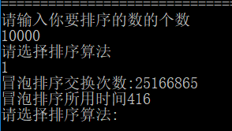
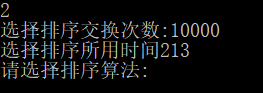
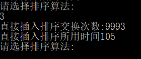
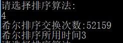
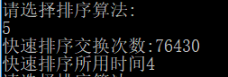
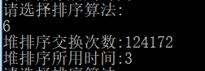
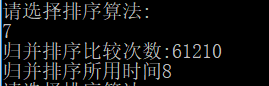
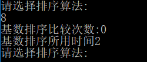
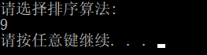
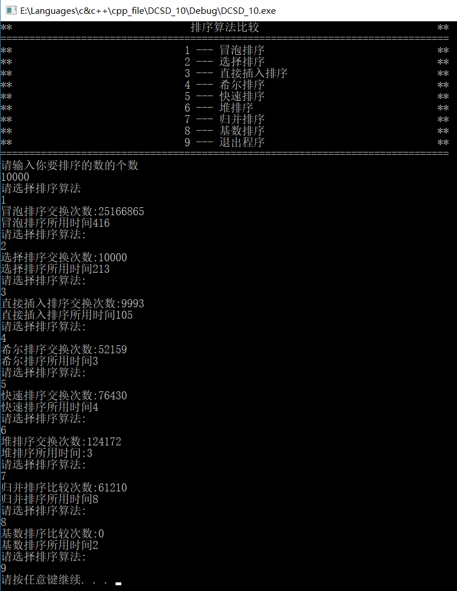

# 数据结构课程设计

#### 作者：1651718 方沛

[TOC]


## 8种排序算法的比较案例 项目说明文档

### 0.项目简介
随机函数产生一百，一千，一万和十万个随机数，用快速排序，直接插入排序，冒泡排序，选择排序的排序方法排序，并统计每种排序所花费的排序时间和交换次数。其中，随机数的个数由用户定义，系统产生随机数。并且显示他们的比较次数。
请在文档中记录上述数据量下，各种排序的计算时间和存储开销，并且根据实验结果说明这些方法的优缺点。

### 1.项目实现
#### 冒泡排序
- 冒泡排序：重复地走访过要排序的数列，一次比较两个元素，如果他们的顺序错误就把他们交换过来。走访数列的工作是重复地进行直到没有再需要交换，也就是说该数列已经排序完成。

```c++
void bubbleSort(int * _array,int _size) {
	int * s_array = new int[_size];
	memcpy(s_array, _array, sizeof(int)*_size);
	bool exchange = false;
	int counts = 0; 
	int begin = clock();
	for (int i = 1; i < _size; i++) {
		exchange = false;
		for (int j = _size - 1; j >= i; j--) {
			if (s_array[j] < s_array[j - 1]) {
				int temp = s_array[j-1];
				s_array[j - 1] = s_array[j];
				s_array[j] = temp;
				counts++;
				exchange = true;
			}
		}
		if (exchange == false) {
			break;
		}
	}
	int end = clock();
	cout << "冒泡排序交换次数:" << counts << endl;
	cout << "冒泡排序所用时间" << end - begin << endl;
}
```


#### 选择排序
- 选择排序：每一次从待排序的数据元素中选出最小（或最大）的一个元素，存放在序列的起始位置，直到全部待排序的数据元素排完。

```c++
void selectionSort(int * _array, int _size) {
	int * s_array = new int[_size];
	memcpy(s_array, _array, sizeof(int)*_size);
	int counts = 0;
	int begin = clock();
	for (int i = 0; i < _size; i++) {
		int min = INT_MAX; int anc = 0;
		for (int j = i; j < _size; j++) {
			if (s_array[j] < min) {
				min = s_array[j]; anc = j;
			}
		}
		int temp = s_array[i];
		s_array[i] = s_array[anc];
		s_array[anc] = temp;
		counts++;
	}
	int end = clock();
	cout << "选择排序交换次数:" << counts << endl;
	cout << "选择排序所用时间" << end - begin << endl;
}
```


#### 直接插入排序
- 直接插入排序：第一趟比较前两个数，然后把第二个数按大小插入到有序表中； 第二趟把第三个数据与前两个数从后向前扫描，把第三个数按大小插入到有序表中；依次进行下去，进行了(n-1)趟扫描以后就完成了整个排序过程。

```c++
void insertSort(int * _array, int _size) {
	int * s_array = new int[_size];
	memcpy(s_array, _array, sizeof(int)*_size);
	int counts = 0;
	int begin = clock();
	for (int i = 0; i < _size-1; i++) {
		if (s_array[i + 1] < s_array[i]) {
			int temp = s_array[i + 1];
			int scaner = i;
			while (scaner >= 0 && s_array[scaner] > temp) {
				s_array[scaner + 1] = s_array[scaner];
				scaner--;
			}
			s_array[scaner + 1] = temp;
			counts++;
		}
	}
	int end = clock();
	cout << "直接插入排序交换次数:" << counts << endl;
	cout << "直接插入排序所用时间" << end - begin << endl;
}
```

#### 希尔排序
- 希尔排序：把记录按下标的一定增量分组，对每组使用直接插入排序算法排序；随着增量逐渐减少，每组包含的关键词越来越多，当增量减至1时，整个文件恰被分成一组，算法便终止。

```c++
void shellSort(int *_array, int _size) {
	int * s_array = new int[_size];
	memcpy(s_array, _array, sizeof(int)*_size);
	int counts = 0;
	int begin = clock();
	int gap = _size - 1 - 1 + 1;
	while (gap >= 1) {
		for (int i = 0; i + gap < _size; i++) {
			if (s_array[i] > s_array[i + gap]) {
				int temp = s_array[i + gap];
				int scaner = i;
				while (scaner >= 0 && s_array[scaner] > temp) {
					s_array[scaner + gap] = s_array[scaner];
					scaner -= gap;
				}
				s_array[scaner + gap] = temp;
				counts++;
			}
		}

		if (gap != 1) {
			gap = gap / 3 + 1;
		}
		else {
			break;
		}
	}
	int end = clock();
	cout << "希尔排序交换次数:" << counts << endl;
	cout << "希尔排序所用时间" << end - begin << endl;

}
```

#### 快速排序
- 快速排序：通过一趟排序将要排序的数据分割成独立的两部分，其中一部分的所有数据都比另外一部分的所有数据都要小，然后再按此方法对这两部分数据分别进行快速排序，整个排序过程可以递归进行，以此达到整个数据变成有序序列。

```c++
int Partition(int * s_array, int _size, int &counts) {
	int pivotpos = 0; int pivot = s_array[0];
	for (int i = 1; i < _size; i++) {
		if (s_array[i] < pivot) {
			pivotpos++;
			if (pivotpos != i) {
				int temp = s_array[i];
				s_array[i] = s_array[pivotpos];
				s_array[pivotpos] = temp;
				counts++;
			}
		}
	}
	s_array[0] = s_array[pivotpos]; s_array[pivotpos] = pivot;
	counts++;
	return pivotpos;
}
void quickSort(int * s_array, int _size,int &counts) {
	if (_size > 1) {
		int pivotpos = Partition(s_array, _size,counts);
		quickSort(s_array, pivotpos ,counts);
		quickSort(s_array + pivotpos + 1, _size - pivotpos-1,counts);
	}
}
void quickSortHelp(int *_array, int _size) {
	int * s_array = new int[_size];
	memcpy(s_array, _array, sizeof(int)*_size);
	int counts = 0;
	int start = clock();
	quickSort(s_array, _size, counts);
	int end = clock();
	cout << "快速排序交换次数:" << counts << endl;
	cout << "快速排序所用时间" << end - start << endl;
}
```

#### 堆排序
- 堆排序：利用堆积树（堆）这种数据结构所设计的一种排序算法，它是选择排序的一种。可以利用数组的特点快速定位指定索引的元素。堆分为大根堆和小根堆，是完全二叉树。大根堆的要求是每个节点的值都不大于其父节点的值，即A[PARENT[i]] >= A[i]。在数组的非降序排序中，需要使用的就是大根堆，因为根据大根堆的要求可知，最大的值一定在堆顶。

```c++
void HeapAdjust(int * s_array, int i, int _size,int &count) {
	int temp = s_array[i];//先取出当前元素i
	for (int k = i * 2 + 1; k<_size; k = k * 2 + 1) {//从i结点的左子结点开始，也就是2i+1处开始
		if (k + 1<_size && s_array[k]<s_array[k + 1]) {//如果左子结点小于右子结点，k指向右子结点
			k++;
		}
		if (s_array[k] >temp) {//如果子节点大于父节点，将子节点值赋给父节点（不用进行交换）
			s_array[i] = s_array[k];
			i = k;
			count++;
		}
		else {
			break;
		}
	}
	s_array[i] = temp;//将temp值放到最终的位置
}
void heapSort(int * _array,int _size) {
	int *s_array= new int[_size];;
	int begin, end;
	int count = 0;
	memcpy(s_array, _array, sizeof(int) * _size);
	begin = clock();
	for (int i = _size / 2 - 1; i >= 0; --i) {
		HeapAdjust(s_array, i, _size, count);
	}
	for (int i = _size - 1; i >= 0; i--) {
		count++;
		int temp = s_array[i];
		s_array[i] = s_array[0];
		s_array[0] = temp;
		HeapAdjust(s_array, 0, i,count);
	}

	end = clock();
	delete[] s_array;
	cout << "堆排序交换次数:" << count << endl;
	cout << "堆排序所用时间:" << end - begin  << endl;
}
```

#### 归并排序
- 归并排序：比较a[i]和a[j]的大小，若a[i]≤a[j]，则将第一个有序表中的元素a[i]复制到r[k]中，并令i和k分别加上1；否则将第二个有序表中 的元素a[j]复制到r[k]中，并令j和k分别加上1，如此循环下去，直到其中一个有序表取完，然后再将另一个有序表中剩余的元素复制到r中从下标k到 下标t的单元。归并排序的算法我们通常用递归实现，先把待排序区间[s,t]以中点二分，接着把左边子区间排序，再把右边子区间排序，最后把左区间和右区 间用一次归并操作合并成有序的区间[s,t]。
```c++
void merge(int* s_array, int mid, int _size,int &count) {
	int * temp = new int[_size];
	int i = 0;//左序列指针
	int j = mid + 1;//右序列指针
	int t = 0;//临时数组指针
	while (i <= mid && j < _size) {
		if (s_array[i] <= s_array[j]) {
			temp[t++] = s_array[i++];
			count++;
		}
		else {
			temp[t++] = s_array[j++];
			
		}
	}
	while (i <= mid) {//将左边剩余元素填充进temp中
		temp[t++] = s_array[i++];
	}
	while (j < _size) {//将右序列剩余元素填充进temp中
		temp[t++] = s_array[j++];
	}
	t = 0;
	//将temp中的元素全部拷贝到原数组中
	memcpy(s_array, temp, sizeof(int) * _size);
	delete[]temp;
}

void mergeSort(int * s_array, int _size,int &count) {
	if (_size > 1) {
		int mid = (_size - 1) / 2;//中间元素的下标
		mergeSort(s_array, mid + 1,count);//_size是mid+1
		mergeSort(s_array + mid + 1, _size - mid - 1,count);//右边归并排序，使得右子序列有序
		merge(s_array, mid, _size,count);//将两个有序子数组合并操作
	}
}
void mergeSortHelp(int * _array, int _size) {
	int *s_array = new int[_size];
	memcpy(s_array, _array, sizeof(int) * _size);
	int count = 0;
	int start = clock();
	mergeSort(s_array, _size,count);
	int end = clock();
	cout << "归并排序比较次数:" << count << endl;
	cout << "归并排序所用时间" << end - start << endl;
}
```

#### 基数排序

- 基数排序：透过键值的部份资讯，将要排序的元素分配至某些“桶”中，藉以达到排序的作用。

  
```c++
int getMax(int s_array[], int _size)
{
	int i, max;
	max = s_array[0];
	for (i = 1; i < _size; i++)
		if (s_array[i] > max)
			max = s_array[i];
	return max;
}


void countSort(int * s_array, int _size, int exp)
{         
	int i, buckets[10] = { 0 };
	int * outputs = new int[_size];

	for (i = 0; i < _size; i++)
		buckets[(s_array[i] / exp) % 10]++;

	for (i = 1; i < 10; i++)
		buckets[i] += buckets[i - 1];

	for (i = _size - 1; i >= 0; i--)
	{
		outputs[buckets[(s_array[i] / exp) % 10] - 1] = s_array[i];
		buckets[(s_array[i] / exp) % 10]--;
	}

	for (i = 0; i < _size; i++)
		s_array[i] = outputs[i];
}

void radixSort(int * _array, int _size)
{
	int start = clock();
	int exp;    // 指数。当对数组按各位进行排序时，exp=1；按十位进行排序时，exp=10；...
	int max = getMax(_array, _size);    // 数组a中的最大值
	int * s_array = new int[_size];
	memcpy(s_array, _array, sizeof(int) * _size);				   // 从个位开始，对数组a按"指数"进行排序
	for (exp = 1; max / exp > 0; exp *= 10) {
		countSort(s_array, _size, exp);
	}
	int end = clock();
	cout << "基数排序比较次数:" << 0 << endl;
	cout << "基数排序所用时间" << end - start << endl;
}
```

#### 退出程序



#### 整体比较


### 3.重要变量
```c++
//储存排序的规模
int sort_size
//排序数组
int * sort_array
//排序数组的副本,排序不会在里面
int *  _array
```

### 4.结论
	常见的排序算法都是比较排序，非比较排序包括计数排序、桶排序和基数排序，非比较排序对数据有要求，因为数据本身包含了定位特征，所有才能不通过比较来确定元素的位置。
	比较排序的时间复杂度通常为O(n2)或者O(nlogn)，比较排序的时间复杂度下界就是O(nlogn)，而非比较排序的时间复杂度可以达到O(n)，但是都需要额外的空间开销。
	用到二叉树特性的排序方法普遍较快,理论上说快速排序最快,但在10000的规模下比较中基数排序,希尔排序,归并排序,快速排序,堆排序这几种排序方法没有明显差距。

### 5.CentOS7编译
- g++中memset定义在<string.h>中,要把<string>改成<string.h>
- g++中没有INT_MAX 需要自行define 一个
