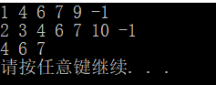
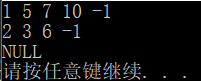
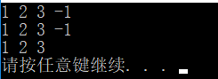
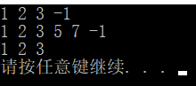
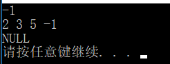
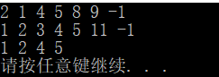

# 数据结构课程设计

#### 作者：1651718 方沛

[TOC]

## 两个有序链表序列的交集项目说明文档

### 0.项目简介
- 项目内容
已知两个非降序链表序列S1和S2，设计函数构造出S1和S2的交集新链表S3。

- 项目功能要求：(采用链表)
1. 输入说明：输入分2行，分别在每行给出由若干个正整数构成的非降序序列，用-1表示序列的结尾（-1不属于这个序列）。数字用空格间隔。
2. 输出说明：在一行中输出两个输入序列的交集序列，数字间用空格分开，结尾不能有多余空格；若新链表为空，输出NULL。

### 1.核心代码
#### 解释说明
对a链和b链各自创建指针pa，pb，结果存在新链c上，a链和b链数据相等则给新链添加新项，a链和b链指针后移。a链值大则b链指针后移，b链值大则a链指针后移。**

#### 源码
```c++
friend List * intersection(List * a, List * b) {
		List * c = new List();
		LinkNode * pc = c->sentinal;
		LinkNode * pa = a->sentinal->link;
		LinkNode * pb = b->sentinal->link;
		while (pa != NULL && pb != NULL) {
			if (pa->data == pb->data) {
				pc->link = new LinkNode(pa->data);
				pc = pc->link;
				pa = pa->link;
				pb = pb->link;
			}
			else if (pa->data > pb->data) {
				pb = pb->link;
			}
			else {
				pa = pa->link;
			}
		}
		return c;
	}
```

### 2.项目效果
- 一般情况


- 交集为空的情况


- 完全相交的情况


- 其中一个序列完全属于交集的情况


- 其中一个序列为空的情况



### 3. 类及类成员介绍

- #### node类  

  - ##### 成员变量
  |成员名称|属性|类型|描述|
  |--------|---|---|----|
  |value| private |int|节点数据|
  |link|private|node* |指向下一个节点指针|


  - ##### 成员函数  
|函数名称|返回值类型|描述|
|--------|--------|----|
|node|void|构造函数|
|printAll|void|打印整个序列|
|add_value_with_order|void|如果输入非非降序，调整为非降序|
||||


### 4.类的实现
- #### node类的定义
```c++
class node {
private:
	int value;
	node * link = NULL;
public:
	node() { value = -1; link = NULL; }
	node(int _input) { value = _input; link = NULL; };
	void printAll();
	void add_value_with_order(int _input);
	friend node* get_intersection(node *l1, node *l2);
};
```
#### node类的实现
```c++
void node::add_value_with_order(int _input) {
	node * scanner = NULL;
	if (link == NULL) {
		link = new node(_input);
		return;
	}
	else if (_input <= link->value) {
		node * temp = new node(_input);
		temp->link = link;
		link = temp;
		return;
	}
	else {
		scanner = link;
		while (scanner->link != NULL) {
			if (scanner->value <= _input&&scanner->link->value >= _input) {
				node * temp = new node(_input);
				temp->link = scanner->link;
				scanner->link = temp;
				return;
			}
			scanner = scanner->link;
		}

	}
	if (scanner->link == NULL) {
		scanner->link = new node(_input);
	}
}
node* get_intersection(node *l1, node*l2) {
	node * l3 = new node();
	if (l1->link == NULL || l2->link == NULL) {
		return l3;
	}
	else {
		node * s1 = l1->link;
		node * s2 = l2->link;
		node * s3 = l3;
		while (s1 != NULL&&s2 != NULL) {
			if (s1->value <s2->value) {
				s1 = s1->link;
			}
			else if (s1->value > s2->value) {
				s2 = s2->link;
			}
			else {
				s3->link = new node(s1->value);
				s3 = s3->link;
				s1 = s1->link;
				s2 = s2->link;
			}
		}
	}
	return l3;
}
void node::printAll() {
	if (link == NULL) {
		cout << "NULL";
	}
	else {
		cout << link->value;
		node * scan = link->link;
		while (scan != NULL) {
			cout <<" "<< scan->value ;
			scan = scan->link;
		}
	}
	cout << endl;
}
```
#### 思路概述
对于要合并的两个序列s1和s2,创建一个结果链s3,当s1和s2有一个为NULL时直接输出NULL,否则则用双指针一一遍历两个链表,如果s1指针所指内容小于s2则后移s1指针,反之亦然.直到一方为空,如果相同则在s3新建一个节点储存相同的值然后同时后移s1,s2指针,知道一方为空.

### 5.容错计算
对于未按照非降序输入的序列,使用add_value_with_order保证输入顺序,依然能得到正确结果.


### 6.CentOS7编译

- 可直接编译