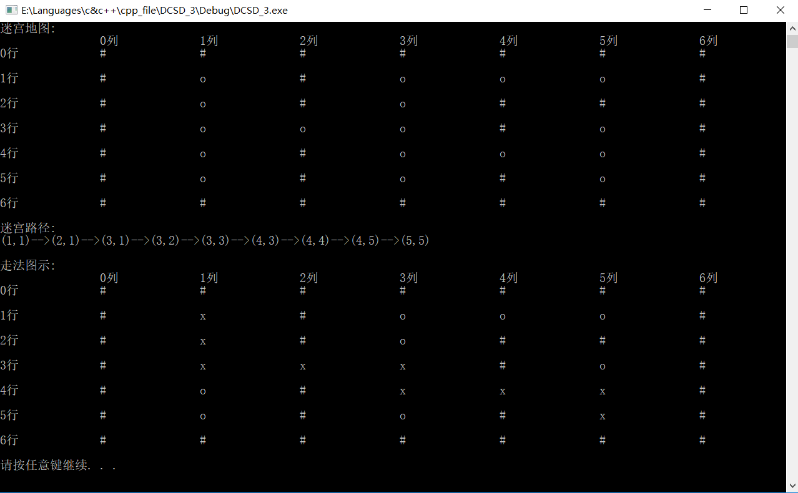

# 数据结构课程设计

#### 作者：1651718 方沛

[TOC]


## 勇闯迷宫游戏项目说明文档

### 0.项目简介
项目简介：
迷宫只有两个门，一个门叫入口，另一个门叫出口。一个骑士骑马从入口进入迷宫，迷宫设置很多障碍，骑士需要在迷宫中寻找通路以到达出口。

- 项目功能要求：
迷宫问题的求解过程可以采用回溯法即在一定的约束条件下试探地搜索前进，若前进中受阻，则及时回头纠正错误另择通路继续搜索的方法。从入口出发，按某一方向向前探索，若能走通，即某处可达，则到达新点，否则探索下一个方向；若所有的方向均没有通路，则沿原路返回前一点，换下一个方向再继续试探，直到所有可能的道路都探索到，或找到一条通路，或无路可走又返回入口点。在求解过程中，为了保证在达到某一个点后不能向前继续行走时，能正确返回前一个以便从下一个方向向前试探，则需要在试探过程中保存所能够达到的每个点的下标以及该点前进的方向，当找到出口时试探过程就结束了。


### 1.核心代码
#### 解释说明
根据题意可以看出这是一个有关搜索的题目，并且这可以算是一个深度优先搜索的题目，其中DFS中的一个重要的思想就是回溯，即储存之前经过节点的信息,一旦发现路径不同即返回查找,利用回溯的话是非常适合解决这类题目的。

上交的程序中我使用了默认地图
#### 思路简述
采用递归的方式,递归的终止条件是到达地图的边缘,如果到达则返回true,对于任意一个处于指定坐标的findPath,一旦发现上下左右有未被障碍物占据的坐标,则进入对应坐标的findPath函数,并利用findPath的返回值,确定是否将当前坐标压入栈中(即该坐标是正确路径的一部分),若传回的值是false,证明前方路径无法到达终点,如果上下左右四个点的findPath都传回false,则本身也传回false,供上一级函数继续使用.

上交的程序中我使用了默认地图
#### 源码
```c++
bool Maze::findPath(step nowstep) {
//递归终止条件
	if (nowstep.x == MaxHeight) {
		pathContainer.push(nowstep);
		return true;
	}
//寻路过程
	if (nowstep.y + 1 <= MaxHeight&&mys_array[nowstep.x][nowstep.y + 1] == 'o'&&previous != step{ nowstep.x ,nowstep.y + 1 }) {
		previous = nowstep;
		if (findPath({ nowstep.x,nowstep.y + 1 })) {
			pathContainer.push(nowstep);
			return true;
		};
	}
	if (nowstep.y - 1 >= 1 && mys_array[nowstep.x][nowstep.y - 1] == 'o'&&previous != step{ nowstep.x ,nowstep.y - 1 }) {
		previous = nowstep;
		if (findPath({ nowstep.x,nowstep.y - 1 })) {
			pathContainer.push(nowstep);
			return true;
		};
	}
	
	if (nowstep.x + 1 <= MaxLength&&mys_array[nowstep.x + 1][nowstep.y] == 'o'&&previous != step{ nowstep.x + 1,nowstep.y }) {
		previous = nowstep;
		if (findPath({ nowstep.x + 1,nowstep.y })) {
			pathContainer.push(nowstep);
			return true;
		};
	}
	if (nowstep.x - 1 >= 1 && mys_array[nowstep.x - 1][nowstep.y] == 'o'&&previous != step{nowstep.x-1,nowstep.y}) {
		previous = nowstep;
		if (findPath({ nowstep.x - 1 ,nowstep.y })) {
			pathContainer.push(nowstep);
			return true;
		};
	}
	//当前路径无法到达终点的分支判断
	else {
		previous = nowstep;
		return false;
	}
	return true;
}
```

### 2.项目效果


### 3.重要变量
```c++
//地图
char mys_array[7][7] = {
		'#','#','#','#','#','#','#',
		'#','o','#','o','o','o','#',
		'#','o','#','o','#','#','#',
		'#','o','o','o','#','o','#',
		'#','o','#','o','o','o','#',
		'#','o','#','o','#','o','#',
		'#','#','#','#','#','#','#'
	};
//坐标类,数据储存的最小单位
class step {
private:
public:
	int x;
	int y;
	step(int _x, int _y) :x(_x), y(_y) { ; };
	step(const step &_s) :x(_s.x), y(_s.y) { ; };
	step() { x = 0; y = 0; };
	bool operator!=(const step &_s){
		if (_s.x != x || _s.y != y) {
			return true;
		}
		else {
			return false;
		}
	};
};
//保存迷宫路径，用于结束时输出
stack<step> pathContainer;
//当前坐标和前一坐标
step current{ 0,0 };
step previous{ 0,0 };


```
### 4.重要函数
#### 迷宫输出函数
```c++
	cout << "迷宫地图:" << endl;
	cout << "		0列		1列		2列		3列		4列		5列		6列" << endl;
	for (int i = 0; i <= 6; i++) {
		cout << i << "行" << "		";
		for (int j = 0; j <= 6; j++) {
			cout << solution.mys_array[i][j] << "		";
		}
		cout << endl;
	}
```
#### 路径输出函数
```c++
	void Maze::printPath() {
	if (!pathContainer.empty()) {
		cout << "(" << pathContainer.top().x <<","<<pathContainer.top().y << ")";
		mys_array[pathContainer.top().x][pathContainer.top().y] = 'x';
		pathContainer.pop();
	}
	while (!pathContainer.empty()) {
		cout << "-->" << "(" << pathContainer.top().x << "," << pathContainer.top().y << ")";
		mys_array[pathContainer.top().x][pathContainer.top().y] = 'x';
		pathContainer.pop();
	}
	cout << endl << endl;
}
```

### 5.容错测试
**本来终点设置了 `pos end = { 5,5 };`我们改为` pos end = { 5,4 };`,地图中是有障碍物#占据的，运行结果符合设计**


### 6.CentOS7编译
- g++支持ininitializer_list,但二维数组赋值需要更改
```c++
char mys_array[7][7] = {
		'#','#','#','#','#','#','#',
		'#','o','#','o','o','o','#',
		'#','o','#','o','#','#','#',
		'#','o','o','o','#','o','#',
		'#','o','#','o','o','o','#',
		'#','o','#','o','#','o','#',
		'#','#','#','#','#','#','#'
	};
```
改为
```c++
char mys_array[7][7] = {
		{'#','#','#','#','#','#','#'},
		{'#','o','#','o','o','o','#'},
		{'#','o','#','o','#','#','#'},
		{'#','o','o','o','#','o','#'},
		{'#','o','#','o','o','o','#'},
		{'#','o','#','o','#','o','#'},
		{'#','#','#','#','#','#','#'}
	};
```