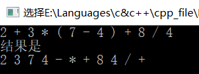
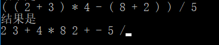
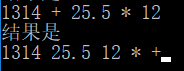
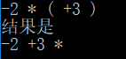
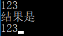

# 数据结构课程设计

#### 作者：1651718 方沛

[TOC]

## 表达式转换项目说明文档

### 0.项目简介
算数表达式有前缀表示法，中缀表示法和后缀表示法等形式。日常使用的算术表达式是采用中缀表示法，即二元运算符位于两个运算数中间。请设计程序将中缀表达式转换成为后缀表达式。

- 项目要求：
1. 输入说明：输入在一行中给出以空格分隔不同对象的中缀表达式，可包含+, -, *, /, -, *, /以及左右括号，表达式不超过20个字符（不包括空格）。
2. 输出说明：在一行中输出转换后的后缀表达式，要求不同对象（运算数，运算符号）之间以空格分隔，但是结尾不得有多余空格。
3. 测试用例
2 + 3 * ( 7 - 4 ) + 8 / 4
( ( 2 + 3 ) * 4 - ( 8 + 2 ) ) / 5
1314 + 25.5 * 12
-2 * ( +3 )
123

### 1.核心代码
#### 解释说明
整体思路：
2.2）实例
规则很多，还是用实例比较容易说清楚整个过程。以输入为a + b * c + (d * e + f)*g，处理过程如下：
1）首先读到a，直接输出。
2）读到“+”，将其放入到栈中。
3）读到b，直接输出。
此时栈和输出的情况如下
4）读到“*”，因为栈顶元素"+"优先级比" * " 低，所以将" * "直接压入栈中。
5）读到c，直接输出。
此时栈和输出情况如下：
6）读到" + "，因为栈顶元素" * "的优先级比它高，所以弹出" * "并输出， 同理，栈中下一个元素" + "优先级与读到的操作符" + "一样，所以也要弹出并输出。然后再将读到的" + "压入栈中。
此时栈和输出情况如下：
7）下一个读到的为"("，它优先级最高，所以直接放入到栈中。
8）读到d，将其直接输出。
此时栈和输出情况如下：
9）读到" * "，由于只有遇到" ) "的时候左括号"("才会弹出，所以" * "直接压入栈中。
10）读到e，直接输出。
此时栈和输出情况如下：
11）读到" + "，弹出" * "并输出，然后将"+"压入栈中。
12）读到f，直接输出。
此时栈和输出情况
13）接下来读到“）”，则直接将栈中元素弹出并输出直到遇到"("为止。这里右括号前只有一个操作符"+"被弹出并输出。
14）读到" * "，压入栈中。读到g，直接输出。
15）此时输入数据已经读到末尾，栈中还有两个操作符“*”和" + "，直接弹出并输出。
#### 源码
```c++
for (int i = 0; i < _inString.length(); i++) {
		if (_inString[i] == ' ') {
			continue;
		}
		else if (is_num(_inString[i])||_inString[i]=='.') {
			_outString[index++] = _inString[i];
		}
		else if (is_subadd(_inString[i])) {
			//正负号
			if (i - 1 < 0 || (!is_num(_inString[i - 1])&&_inString[i-1]!=')')) {
				_outString[index++] = _inString[i];
			}
			//乘除号
			else {
				while (!signals.empty()
					&& prior_list[signals.top()] >= prior_list[_inString[i]]
					&& signals.top() != '(') {
					_outString[index++] = ' ';
					_outString[index++] = signals.top();
					signals.pop();
				}
				_outString[index++] = ' ';
				signals.push(_inString[i]);
			}
		}
		else if (is_multidiv(_inString[i])) {
			while (!signals.empty() 
				&& prior_list[signals.top()] >= prior_list[_inString[i]]
				&& signals.top()!='(') {
				_outString[index++] = ' ';
				_outString[index++] = signals.top();
				signals.pop();
			}
			_outString[index++] = ' ';
			signals.push(_inString[i]);
		}
		else if (_inString[i] == '(') {
			signals.push(_inString[i]);
		}
		else if (_inString[i] == ')') {
			while (signals.top() != '(') {
				_outString[index++] = ' ';
				_outString[index++] = signals.top();
				signals.pop();
			}
			signals.pop();
		}
	}
	while (!signals.empty()) {
		_outString[index++] = ' ';
		_outString[index++] = signals.top();
		signals.pop();
	}
	_outString = trim(_outString);
	return _outString;
}
```
### 2.项目效果
- 正常测试六种运算符


- 嵌套括号


- 运算数超过1位整数且有非整数出现


- 运算数有正或负号


- 只有1个数字




### 3. 重要函数介绍

- #### 判断类  

  | 函数名称 | 参数 | 返回值    | 描述               |
  | -------- | ------ | ---------- | ------------------ |
  | is_num | char | bool       | 是否是数字         |
  | is_subadd | char | bool     | 是否是加减 |
  | is_multidiv | char | bool | 是否是乘除 |

 - #### 处理类  
| 函数名称 | 参数             | 返回值    | 描述 |
| -------- | ---------- | -------- | -------- |
| generate_priority | map<char, int> & | void | 生成符号优先级 |
| trim | string &         | string & | 清除结果中尾部空格 |

### 4.函数实现
- #### 判断类函数实现
```c++
bool is_num(char c) {
	if (c >= '0'&&c <= '9') {
		return true;
	}
	else {
		return false;
	}
}

bool is_subadd(char c) {
	if (c == '-' || c == '+') {
		return true;
	}
	else {
		return false;
	}
}

bool is_multidiv(char c) {
	if (c == '*' || c == '/') {
		return true;
	}
	else {
		return false;
	}
}
```
- #### 处理类函数实现
```c++
void generate_priority(map<char, int> & _prior_list) {
	//数字优先级
	for (int i = 0; i <= 9; i++) {
		_prior_list['0' + i] = 1;
	}
	//加减优先级
	_prior_list['+'] = 2;
	_prior_list['-'] = 2;
	//乘除优先级
	_prior_list['*'] = 3;
	_prior_list['/'] = 3;
	//括号优先级
	_prior_list['('] = 4;
	_prior_list[')'] = 4;
}

string & trim(string &s)
{
	if (s.empty())
	{
		return s;
	}
	s.erase(0, s.find_first_not_of(" "));
	s.erase(s.find_last_not_of(" ") + 1);
	return s;
}

```
### 5.思路概述
虽然说代码看起来很复杂,但是规则实际上非常简单,可以概括为:
转换过程需要用到栈，具体过程如下：

1）如果遇到操作数，我们就直接将其输出。

2）如果遇到操作符，则我们将其放入到栈中，遇到左括号时我们也将其放入栈中。

3）如果遇到一个右括号，则将栈元素弹出，将弹出的操作符输出直到遇到左括号为止。注意，左括号只弹出并不输出。

4）如果遇到任何其他的操作符，如（“+”， “*”，“（”）等，从栈中弹出元素直到遇到发现更低优先级的元素(或者栈为空)为止。弹出完这些元素后，才将遇到的操作符压入到栈中。有一点需要注意，只有在遇到" ) "的情况下我们才弹出" ( "，其他情况我们都不会弹出" ( "。

5）如果我们读到了输入的末尾，则将栈中所有元素依次弹出。

### 6.CentOS7编译
- 可直接编译