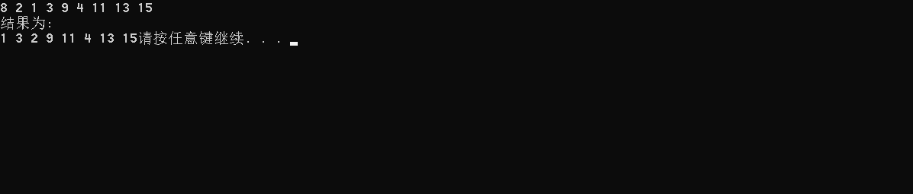
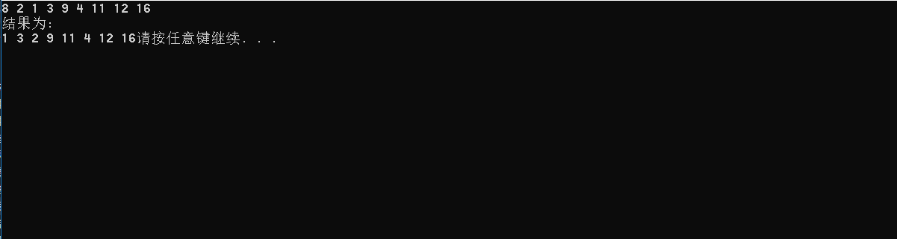

# 数据结构课程设计

#### 作者：1651718 方沛

[TOC]

## 银行业务项目说明文档

### 0.项目简介
设某银行有A，B两个业务窗口，且处理业务的速度不一样，其中A窗口处理速度是B窗口的2倍----即当A窗口每处理完2个顾客是，B窗口处理完1个顾客。给定到达银行的顾客序列，请按照业务完成的顺序输出顾客序列。假定不考虑顾客信后到达的时间间隔，并且当不同窗口同时处理完2个顾客时，A窗口的顾客优先输出。

- 项目功能要求
1. 输入说明：输入为一行正整数，其中第一数字N（N<=1000）为顾客总数，后面跟着N位顾客的编号。编号为奇数的顾客需要到A窗口办理业务，为偶数的顾客则去B窗口。数字间以空格分隔。
2. 输出说明：按照业务处理完成的顺序输出顾客的编号。数字键以空格分隔，但是最后一个编号不能有多余的空格。
3. 测试用例：
8 2 1 3 9 4 11 13 15
8 2 1 3 9 4 11 12 16
1 6 

### 1.核心代码
#### 解释说明
很明显这个题在考队列，刚开始想在一个队列里实现这个过程，最后发现不太现实。所以还是决定创建两个队列 A和B，分别统计奇数和偶数个数（也就是统计A窗口和B窗口的人数）。既然是不考虑顾客先后到达的时间间隔的话，那就统一输出就可以了。（这个题其实好懂，唯一的难点就在于要想清楚如何输出）。
输出的话，设置计时器，每回递加A都pop输出，B只有递加两次才pop输出一次

但是实际上并不需要那么麻烦,只需要两个for循环就可以解决,由于A窗口的顾客优先输出,只需要把处理A的循环放在前面即可,并利用两个数组模拟队列即可,我采用了简单的做法.

#### 源码
```c++
int main(void)
{
	int A[1001];/*用两个数组模拟两个队列*/
	int B[1001];
	int all_guests, number, j = 0, k = 0;
	cin >> all_guests;
	for (int i = 0; i < all_guests; i++)
	{
		//划分不同银行处理的顾客序号
		cin >> number;
		if (number % 2 != 0)
		{
			A[j++] = number;
		}
		else
		{
			B[k++] = number;
		}
	}
	//J和K是处理序列
	int J = 0, K = 0;
	while (j > 0 && k > 0){
		//因为优先处理A,把A的循环放到前面
		for (int i = 0; i < 2; i++) {
			cout << A[J++];
			//当前这个人不是最后一个人就输出空格
			if (all_guests != 1) {
				cout << " ";
			}
			j--; all_guests--;/*A中人数和总人数-1*/
		}

		for (int i = 0; i < 1; i++){
			printf("%d", B[K++]);
			//当前这个人不是最后一个人就输出空格
			if (all_guests != 1){
				printf(" ");
			}
			k--; all_guests--;/*B中人数和总人数-1*/
		}
	}

	while (j>0)/*将A中剩下的人输出*/
	{
		cout<<A[J++];
		if (j != 1){
			cout << " ";
		}
		j--;
	}
	while (k>0)/*将B中剩下的人输出*/
	{
		cout<<B[K++];
		if (k != 1)
		{
			cout << " ";
		}
		k--;
	}
	system("pause");
}
```
### 2.项目效果
- 正常测试，A窗口人多


- 正常测试，B窗口人多


- 最小N


### 3.主要代码段介绍

- #### 控制输入及模拟队列 
```c++
  int A[1001];/*用两个数组模拟两个队列*/
	int B[1001];
	int all_guests, number, j = 0, k = 0;
	cin >> all_guests;
```

- #### 顾客编号分类
```c++
  for (int i = 0; i < all_guests; i++)
  {
  	//划分不同银行处理的顾客序号
  	cin >> number;
  	if (number % 2 != 0)
  	{
  		A[j++] = number;
  	}
  	else
  	{
  		B[k++] = number;
  	}
  }
```
- #### 模拟顾客办理业务
```c++
  //J和K是处理序列
	int J = 0, K = 0;
	while (j > 0 && k > 0){
		//因为优先处理A,把A的循环放到前面
		for (int i = 0; i < 2; i++) {
			cout << A[J++];
			//当前这个人不是最后一个人就输出空格
			if (all_guests != 1) {
				cout << " ";
			}
			j--; all_guests--;/*A中人数和总人数-1*/
		}

		for (int i = 0; i < 1; i++){
			printf("%d", B[K++]);
			//当前这个人不是最后一个人就输出空格
			if (all_guests != 1){
				printf(" ");
			}
			k--; all_guests--;/*B中人数和总人数-1*/
		}
	}
```
- #### 多余顾客输出
```c++
	while (j>0)/*将A中剩下的人输出*/
	{
		cout<<A[J++];
		if (j != 1){
			cout << " ";
		}
		j--;
	}
	while (k>0)/*将B中剩下的人输出*/
	{
		cout<<B[K++];
		if (k != 1)
		{
			cout << " ";
		}
		k--;
	}
	cout << endl;
```
### 4.CentOS7编译
- 可直接编译