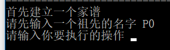
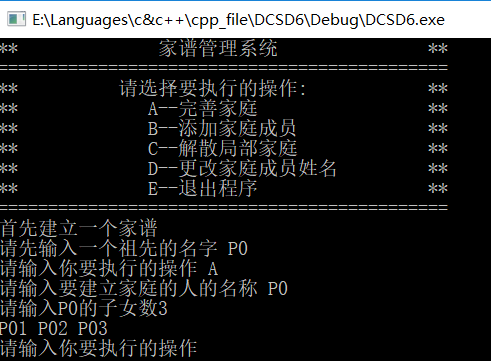
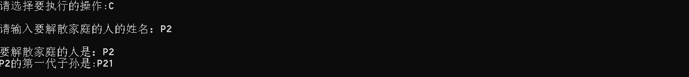
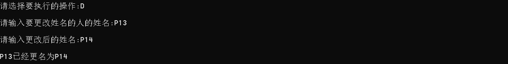
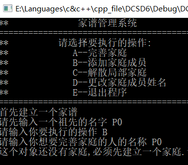
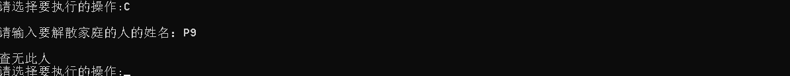

# 数据结构课程设计

#### 作者：1651718 方沛

[TOC]

## 家谱管理系统项目说明文档

### 0.项目简介
家谱是一种以表谱形式，记载一个以血缘关系为主体的家族世袭繁衍和重要任务事迹的特殊图书体裁。家谱是中国特有的文化遗产，是中华民族的三大文献（国史，地志，族谱）之一，属于珍贵的人文资料，对于历史学，民俗学，人口学，社会学和经济学的深入研究，均有其不可替代的独特功能。本项目兑对家谱管理进行简单的模拟，以实现查看祖先和子孙个人信息，插入家族成员，删除家族成员的功能。

- 项目功能要求：
本项目的实质是完成兑家谱成员信息的建立，查找，插入，修改，删除等功能，可以首先定义家族成员数据结构，然后将每个功能作为一个成员函数来完成对数据的操作，最后完成主函数以验证各个函数功能并得到运行结果。

### 1.项目实现
- main函数部分
```c++
int main()
{
	familyTree OneFamily;
	cout << "**              家谱管理系统               **" << endl;
	cout << "=============================================" << endl;
	cout << "**          请选择要执行的操作:            **" << endl;
	cout << "**             A--完善家庭                 **" << endl;
	cout << "**             B--添加家庭成员             **" << endl;
	cout << "**             C--解散局部家庭             **" << endl;
	cout << "**             D--更改家庭成员姓名         **" << endl;
	cout << "**             E--退出程序                 **" << endl;
	cout << "=============================================" << endl;
	cout << "首先建立一个家谱" << endl << "请先输入一个祖先的名字 ";
	member * ancestor = new member;
	cin >> (*ancestor);
	OneFamily.buildTree(ancestor);
	char choise;
	while (true) {
		cout << "请输入你要执行的操作 " ;
		cin >> choise;
		if (choise == 'A') {
			cout << "请输入要建立家庭的人的名称 ";
			member target;
			cin >> target;
			OneFamily.buildFamily(target);
		}
		else if (choise == 'B') {
			cout << "请输入你想要完善家庭的人的名称 ";
			member target;
			cin >> target;
			OneFamily.perfectFamily(target);
		}
		else if (choise == 'C') {
			cout << "请输入你要解散家庭的人的名称 ";
			member target;
			cin >> target;
			OneFamily.disbandFamily(target);
		}
		else if (choise == 'D') {
			cout << "请输入你想要改变的人的名字 ";
			member target;
			cin >> target;
			OneFamily.replaceMember(target);
		}
		else if (choise == 'E') {
			cout << "退出";
			break;
		}
	}
	system("pause");
}
```
- 建立家谱
```c++
void familyTree::buildTree(member * ancestor) {
	master = ancestor;
}
```

- 建立家庭
```c++
void familyTree::buildFamily(member & target) {
	if (master == nullptr) {
		cout << "请先建立你的家谱" << endl;
	}
	else {
		member *p = master->search(target);
		if (p == nullptr) {
			cout << "没有找到建立家庭的对象" << endl;
			return;
		}
		else if (p->noChildren() == false) {
			cout << "这个对象已经有家庭了,不能建立" << endl;
		}
		else {
			cout << "请输入" << p->bkName() << "的子女数" ;
			int childrenMax = 0;
			cin >> childrenMax;
			for (int i = 1; i <= childrenMax; i++) {
				member * temp = new member;
				cin >> (*temp);
				p->addChild(temp);
			}
		}
	}
}
```

- 完善家庭

```c++
void familyTree::perfectFamily(member & target) {
	if (master == nullptr) {
		cout << "请先建立你的家谱" << endl;
	}
	else {
		member * p = master->search(target);
		if (p == nullptr) {
			cout << "没有找到你要找的对象" << endl;
		}
		else if (p->noChildren() == true) {
			cout << "这个对象还没有家庭,必须先建立一个家庭.";
		}
		else {
			cout << "请输入想要插入的儿子(女儿)的名字 ";
			member * temp = new member;
			cin >> (*temp);
			p->addChild(temp);
			cout << target.bkName() << "的第一代子孙是" << temp->bkName() << endl;

		}
	}
}
```


- 删除某人家庭

```c++
void familyTree::disbandFamily(member & target) {
	if (master == nullptr) {
		cout << "请先建立你的家谱" << endl;
	}
	else {
		member * p = master->search(target);
		if (p == nullptr) {
			cout << "没有找到你要删除家庭的对象" << endl;
		}
		else {
			p->eliminate();
		}
	}

```


- 更改家庭成员姓名

```c++
void familyTree::replaceMember(member & target) {
	if (master == nullptr) {
		cout << "请先建立你的家谱" << endl;
	}
	else {
		member * p = master->search(target);
		if (p == nullptr) {
			cout << "没有找到你要修改家庭的对象" << endl;
		}
		else {
			cout << "请输入想要的新名字 ";
			member * temp = new member;
			cin >> (*temp);
			p->changeName(*temp);
		}
	}
}
```


- 退出程序


### 2. 类及类成员介绍

- #### member类  

  - ##### 成员变量
  | 成员名称 | 属性   | 类型       | 描述               |
  | -------- | ------ | ---------- | ------------------ |
  | Name     | private | string        | 节点数据（姓名)           |
  | Children | private | vector<member *> | 储存所有的子女 |

  - ##### 成员函数 (重要的)
  | 函数名称   | 参数     | 返回     | 描述                 |
  | ---------- | -------- | -------- | -------------------- |
  | addChild   | member * | void     | 给成员增加子女       |
  | eliminate  | void     | void     | 删除成员所有子女     |
  | changeName | member & | void     | 改变成员名字         |
  | equal      | member & | bool     | 判断成员是否相等     |
  | noChildren | void     | bool     | 判断成员有没有孩子   |
  | search     | member & | member * | 寻找成员的某一个子女 |

- #### familyTree类  

  - ##### 成员变量
  | 成员名称 | 属性   | 类型       | 描述               |
  | -------- | ------ | ---------- | ------------------ |
  | master | private | member * | 家族树的祖先      |

  - ##### 成员函数  
  | 函数名称 | 参数 | 返回值 | 描述 |
  | -------- | ---------- | -------- | -------- |
  | buildTree | member * | void | 建立家谱 |
  | buildFamily | member & | void   | 建立家庭 |
  | perfectFamily | member & | void | 完善家庭 |
  | disbandFamily | member & | void   | 解散家庭 |
  | replaceMember | member & | void | 更改成员姓名 |


### 3.类的实现
- #### TreeNode的实现

```c++
class member {
private:
	string Name;
	vector<member *> Children;
public:
	member() { ; };
	member(string _Name) :Name(_Name) { ; };
	void addChild(member * _child);
	void eliminate();
	void changeName(member &target);
	bool equal(member & target) ;
	bool member::noChildren();
	string bkName() { return Name; };
	member * search(member &target);
	friend istream& operator >> (istream & is, member & _person);
};
bool member::equal(member & target) {
	return Name == target.Name;
}
member * member::search(member &target) {
	member * p = this;
	if (p->Name == target.Name) {
		return p;
	}
	else {
		if (p->Children.empty()) {
			return nullptr;
		}
		for (int i = 0; i < p->Children.size(); i++) {
			member * temp = (p->Children)[i]->search(target);
			if (temp != nullptr) {
				return temp;
			}
		}
		return nullptr;
	}

}

bool member::noChildren() {
	if (Children.size() == 0) {
		return true;
	}
	else {
		return false;
	}
}
istream & operator >> (istream &is, member &person) {
	string _Name;
	is >> _Name;
	if (is) {
		person.Name = _Name;
	}
	else {
		cout << "fail to cin>>";
	}
	return is;
}
void member::addChild(member * _child) {
	Children.push_back(_child);
}
void member::eliminate() {
	if (Children.size() == 0) {
		return;
	}
	else {
		for (int i = 0; i < Children.size(); i++) {
			(Children[i])->eliminate();
			delete Children[i];
		}
		Children.clear();
		Children.shrink_to_fit();
	}
}
void member::changeName(member &target) {
	Name = target.Name;
}
```
- #### familyTree实现

```c++
class familyTree {
private:
	member * master=nullptr; //默认的家族树首领
public:
	void buildTree(member * ancestor);//建立家谱
	void buildFamily(member & target);//建立家庭
	void perfectFamily(member & target );//完善家庭
	void disbandFamily(member & target);//解散家庭
	void replaceMember(member & target);//更改家庭成员姓名
};
void familyTree::buildTree(member * ancestor) {
	master = ancestor;
}
void familyTree::buildFamily(member & target) {
	if (master == nullptr) {
		cout << "请先建立你的家谱" << endl;
	}
	else {
		member *p = master->search(target);
		if (p == nullptr) {
			cout << "没有找到建立家庭的对象" << endl;
			return;
		}
		else if (p->noChildren() == false) {
			cout << "这个对象已经有家庭了,不能建立" << endl;
		}
		else {
			cout << "请输入" << p->bkName() << "的子女数" ;
			int childrenMax = 0;
			cin >> childrenMax;
			for (int i = 1; i <= childrenMax; i++) {
				member * temp = new member;
				cin >> (*temp);
				p->addChild(temp);
			}

		}
	}
}
	
void familyTree::perfectFamily(member & target) {
	if (master == nullptr) {
		cout << "请先建立你的家谱" << endl;
	}
	else {
		member * p = master->search(target);
		if (p == nullptr) {
			cout << "没有找到你要找的对象" << endl;
		}
		else if (p->noChildren() == true) {
			cout << "这个对象还没有家庭,必须先建立一个家庭.";
		}
		else {
			cout << "请输入想要插入的儿子(女儿)的名字 ";
			member * temp = new member;
			cin >> (*temp);
			p->addChild(temp);
			cout << target.bkName() << "的第一代子孙是" << temp->bkName() << endl;
			//cout << "输入成功!现在支持添加子女!" << endl;
		}
		
	}
}
void familyTree::disbandFamily(member & target) {
	if (master == nullptr) {
		cout << "请先建立你的家谱" << endl;
	}
	else {
		member * p = master->search(target);
		if (p == nullptr) {
			cout << "没有找到你要删除家庭的对象" << endl;
		}
		else {
			cout << "删除家庭的人" << p->bkName() << endl;
			p->eliminate();
		}
	}

}
void familyTree::replaceMember(member & target) {
	if (master == nullptr) {
		cout << "请先建立你的家谱" << endl;
	}
	else {
		member * p = master->search(target);
		if (p == nullptr) {
			cout << "没有找到你要修改家庭的对象" << endl;
		}
		else {
			cout << "请输入想要的新名字 ";
			member * temp = new member;
			cin >> (*temp);
			p->changeName(*temp);
		}
	}
}
```
### 4.思路简述
- 采用传统的n-叉树实现familyTree中每个成员和子女的连接，访问时遍历每个vector成员，将整个家庭构造成树的结构。在添加新家庭成员时，只需在vector里面增加成员。同样，解散家庭成员时，清空vector并且shrink_to_fit。完善家庭成员时，往vector里添加一个成员即可。
- 当需要添加家庭成员使用，先执行搜索函数查找某个人。找到之后将需要添加的链表加在该节点下方。兄弟节点连在sibling指针后，孩子则连在child后，添加孩子时需要检测孩子指针是否为空，如果不是空就将操作指针移动到最后一个孩子，然后对siblling进行操作，如果没有孩子，直接将该节点接在child节点上。

### 5.容错测试

当一个查找对象不存在时，都支持提示不存在并重新输入，同时，如果在没有完善家庭的情况下 添加成员，都会提示让先添加成员。
-  在添加成员前没有完善成员


- 完善家谱建立家庭的人不存在


- 添加家庭成员的父节点不存在


- 解散局部家庭的父节点不存在



- 要更改姓名的家庭成员不存在

