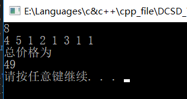
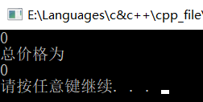

# 数据结构课程设计

#### 作者：1651718 方沛

[TOC]

## 修理牧场项目说明文档

### 0.项目简介
农夫要修理牧场的一段栅栏，他测量了栅栏，发现需要N块木头，每块木头长度为整数Li个长度单位，于是他购买了一个很长的，能锯成N块的木头，即该木头的长度是Li的总和。
但是农夫自己没有锯子，请人锯木的酬金跟这段木头的长度成正比。为简单起见，不妨就设酬金等于所锯木头的长度。例如，要将长度为20的木头锯成长度为8，7和5的三段，第一次锯木头将木头锯成12和8，花费20；第二次锯木头将长度为12的木头锯成7和5花费12，总花费32元。如果第一次将木头锯成15和5，则第二次将木头锯成7和8，那么总的花费是35（大于32）.

- 项目功能要求：
1. 输入格式：输入第一行给出正整数N（N小于10的四次方），表示要将木头锯成N块。第二行给出N个正整数，表示每块木头的长度。
2. 输出格式：输出一个整数，即将木头锯成N块的最小花费。

### 1.核心代码
#### 解释说明
- 此题采用哈夫曼树作为解法，哈夫曼树简单来说就是带权路径长度最短的树，也称为最优二叉树。那怎么让它的带权路径最短呢，这就要先说一下带权路径长度怎么算了。
- `WPL = ∑wi·li`      意思是，节点的权值与它到根的距离相乘，然后把每个节点的这个乘积相加
 所以，要想带权路径长度（WPL）最短，就要让权值越大的节点，与根的距离越小

- 具体过程就出来了，首先选两个权值最小的点，权值相加，权值和赋给一个新的节点，即构成哈夫曼树最底层的一颗字数把这个新的节点加到节点列表中，而这两个用来相加的节点当然就要从节点列表中删去了，如此往复，就会得到一颗哈夫曼树了,此时节点列表中只剩下一个节点
- 最后，说一下这里这个题，我这里并没有建树，而是用的优先队列，但由于每次只需要最小的两个元素,只要定义一个数组进行排序即可,这也是运行速度最快的方法。

#### 源代码
```c++
#include <iostream>
#include <deque>
#include <algorithm>
using namespace std;

deque<int> huf_order;
int map[10005];
int sum, total;

int main()
{
	int n;
	sum = total = 0;
	cin>>n;
	for (int i = 1; i <= n; i++)
	{
		int branch_length;
		cin >> branch_length;
		total += branch_length;
		huf_order.push_back(branch_length);
	}
	sort(huf_order.begin(), huf_order.end());
	while (huf_order.size() > 1)
	{
		int temp;
		temp = huf_order.front();
		huf_order.pop_front();
		temp += huf_order.front();
		sum += temp;
		huf_order.pop_front();
		//		de.push_front(t);
		bool flag = true;
		for (int i = 0; i < huf_order.size(); ++i) {
			if (huf_order[i] >= temp)
			{
				//因为基本有序,所以没有快排
				huf_order.insert(huf_order.begin() + i, temp);
				flag = false;
				break;
			}
		}
		if (flag) {
			//插到队尾
			huf_order.push_back(temp);
		}
	}
	cout << "总价格为" << endl;
	cout<<sum<<endl;
	system("pause");
}
```

### 2.项目效果


### 3. 主要代码介绍

- #### 主要变量  

  - ##### 全局变量
  | 成员名称 | 类型 | 描述       |
  | -------- | ------ | ---------- |
  | huf_order | deque<int> | 初始输入序列 |
  | sum    | int | 输出结果 |

  - ##### 读取输入并且排序
n是要输入的数的上线,然后循环读入branch_length,压入huf_order中,最后进行一波排序,因为哈夫曼树每次都取最小堆顶的两个数组成一颗子数,所以不用构造heap,只要每次取最前面两个即可。
```c++
	int n;
	sum  = 0;
	cin>>n;
	for (int i = 1; i <= n; i++)
	{
		int branch_length;
		cin >> branch_length;
		huf_order.push_back(branch_length);
	}
	sort(huf_order.begin(), huf_order.end());
```
 - ##### 产生哈夫曼树的子树
在取完之前的两个数后，他们的和重新放入队列里，按最小堆调整，注意，由于原deque已经基本有序，快排效率极低，只需要一一遍历插入合适位置即可。
```c++
			bool flag = true;
		for (int i = 0; i < huf_order.size(); ++i) {
			if (huf_order[i] >= temp)
			{
				//因为基本有序,所以没有快排
				huf_order.insert(huf_order.begin() + i, temp);
				flag = false;
				break;
			}
		}
		if (flag) {
			//如果在末尾之前仍没有找到位置，这说明两数之和是数列中最大的，插到队尾
			huf_order.push_back(temp);
		}
	}
```
### 4.容错测试
- 输入木块个数为0

- 输入木块个数为1


### 5.centOS7编译
- 可直接编译


