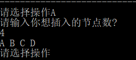
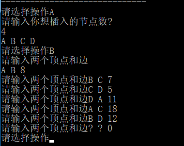
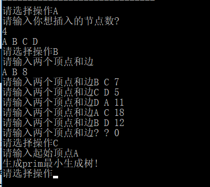
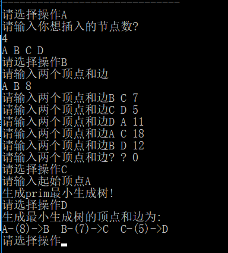
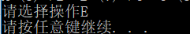

# 数据结构课程设计

#### 作者：1651718 方沛

[TOC]

## 电网建设造价模拟系统项目说明文档

### 0.项目简介
假设一个城市有n个小区，要实现n个小区之间的电网都能够相互接通，构造这个城市n个小区之间的电网，使总工程造价最低。请设计一个能够满足要求的造价方案。

- 项目功能要求：
在每个小区之间都可以设置一条电网线路，都要付出相应的经济代价。n个小区之间最多可以有n（n-1）/2条线路，选择其中的n-1条使总的耗费最少。

### 1.项目实现
- 创建电网顶点

```c++
	void wholemaps::buildNodes() {
	cout << "请输入你想插入的节点数?" << endl;
	int nums=0;
	cin >> nums;
	for (int i = 0; i < nums; i++) {
		char input;
		cin >> input;
		//建立映射关系
		symbol_to_index[input] = i;
		index_to_symbol[i] = input;
		
		list<graphnode> expr;
		all_nodes[input] = expr;
	}
}
```

- 添加电网的边

```c++
void wholemaps::appendLines() {
	char nd1='1', nd2='1'; int lg=1;
	while (true) {
		cout << "请输入两个顶点和边";
		cin >> nd1 >> nd2 >> lg;
		if (nd1 == '?') {
			break;
		}
		auto r = graphnode(symbol_to_index[nd2],lg);
		all_nodes[nd1].push_back(r);
		auto k = graphnode(symbol_to_index[nd1], lg);
		all_nodes[nd2].push_back(k);
	}
}
```


- 构造最小生成树

```c++
	void wholemaps::setupPrim() {
	cout << "请输入起始顶点";
	char start_line;
	cin >> start_line;
	const int nodeLength = all_nodes.size();
	int * lowcost = new int[all_nodes.size()];
	int * nearvex = new int[all_nodes.size()];
	//lowcost初始化
	memset(lowcost, 0, nodeLength * sizeof(int));
	auto scanner = all_nodes[start_line];
	for (auto t = scanner.begin(); t != scanner.end(); t++) {
		lowcost[t->bkdest()] = t->bkcost();
	}
	for (int i = 0; i < all_nodes.size(); i++) {
		if (lowcost[i] == 0) {
			lowcost[i] = MAX_LENGTH;
		}
	}

		lowcost[symbol_to_index[start_line]] = 0;
		//nearvex初始化
		memset(nearvex, 0, nodeLength * sizeof(int));
		nearvex[symbol_to_index[start_line]] = -1;


		for (int n = 1; n < all_nodes.size(); n++) {
			int ancher_index = symbol_to_index[start_line];
			int min_distance = MAX_LENGTH; int scaner = 0;
			for (int i = 0; i < nodeLength; i++) {
				if (nearvex[i] != -1 && lowcost[i] < min_distance) {
					scaner = i;
					min_distance = lowcost[i];
				}
			}
			edge temp(index_to_symbol[nearvex[scaner]], min_distance, index_to_symbol[scaner]);
			routine.push_back(temp);
			nearvex[scaner] = -1;
		

			for (int i = 0; i < nodeLength; i++) {
				if (nearvex[i] != -1 && edgeDistance(scaner, i) < lowcost[i]) {
					nearvex[i] = scaner;
					lowcost[i] = edgeDistance(scaner, i);
				}
			}
		}
		cout << "生成prim最小生成树!" << endl;
}
```


- 显示最小生成树

```c++
	void wholemaps::displayPrim() {
	cout << "生成最小生成树的顶点和边为:" << endl;
	for (int i = 0; i < routine.size(); i++) {
		cout << routine[i].start_point << "-(" << routine[i].length << ")->" << routine[i].end_point<<"  ";
	}
	cout << endl;
}
```


- 退出程序



### 2. 类及类成员介绍
- #### Edge类  
  - ##### 成员变量
  | 成员名称 | 属性   | 类型       | 描述               |
  | -------- | ------ | ---------- | ------------------ |
  | start_point | public | int        | 边的起始顶点           |
  | end_point | public | int | 边的终止顶点 |
  | cost    | public | int | 边的权重 |

  - ##### 成员函数  
  | 函数名称 | 参数          | 返回值 | 描述     |
  | -------- | ------------- | ------ | -------- |
  | Edge     | char,int,char | 无     | 构造函数 |

- #### graphnode类

  用于表示图的邻接表表示中非领头节点的每个元素

  - ##### 成员变量
  | 成员名称 | 属性   | 类型       | 描述    |
  | -------- | ------ | ---------- | ------------------ |
  | destination | private | int        | 终止顶点         |
  | cost | private | int  | 边的权重 |

  - ##### 成员函数 (重要的)
  | 函数名称 | 参数 | 返回值 | 描述     |
  | -------- | -------- | ---------- | -------- |
  | graphnode | int,int | 无         | 构造函数 |


- #### wholemaps类  （无向图）

  - ##### 成员变量
  | 成员名称 | 属性   | 类型       | 描述               |
  | -------- | ------ | ---------- | ------------------ |
  | all_nodes | private | map<char, list<graphnode>> | 储存邻接表      |
  | symbol_to_index | private | map<char, int> | 字符到编号转换   |
  | index_to_symbol | private | map<int, char> | 编号到字符转换 |
  | routine | private | vector<edge> | 存储每步路径    |

  - ##### 成员函数(重要的)
  | 函数名称 | 参数 | 返回值 | 描述     |
  | -------- | -------- | ---------- | -------- |
  |buildNodes| void | void    | 建立点         |
  | appendLines | void | void   | 建立边 |
  | setupPrim | void | void         | 生成最小生成树 |
  | display | void | void          | 展示最小生成树 |

- #### 


### 2. 类的实现
- #### graphnode类的实现

```c++
class graphnode {
private:
	int destination;
	int cost;
public:
	int bkdest() { return destination; };
	int bkcost() { return cost; };
	graphnode(int _dest, int _cost) :destination(_dest), cost(_cost) {};
};struct Edge {
	int either;
	int other;
	int cost;
	Edge * link;
	Edge(int either_,int other_, int cost_,Edge * link_) :either(either_),other(other_), cost(cost_), link(link_) {}
};
```
- #### edge类的实现

```c++
class edge {
public:
	char start_point;
	int length;
	char end_point;
	edge(char a, int b, char c) :start_point(a), length(b), end_point(c) {};
};
```

- #### wholemaps类的实现（无向图）

```c++
class wholemaps {
private:
	map<char, list<graphnode>> all_nodes;
	map<char, int> symbol_to_index;
	map<int, char>index_to_symbol;
	vector<edge> routine;
public:
	void buildNodes();
	void appendLines();
	void setupPrim();
	void displayPrim();
	int wholemaps::edgeDistance(int scaner, int i);
};
void wholemaps::displayPrim() {
	cout << "生成最小生成树的顶点和边为:" << endl;
	for (int i = 0; i < routine.size(); i++) {
		cout << routine[i].start_point << "-(" << routine[i].length << ")->" << routine[i].end_point<<"  ";
	}
	cout << endl;
}
void wholemaps::buildNodes() {
	cout << "请输入你想插入的节点数?" << endl;
	int nums=0;
	cin >> nums;
	for (int i = 0; i < nums; i++) {
		char input;
		cin >> input;
		//建立映射关系
		symbol_to_index[input] = i;
		index_to_symbol[i] = input;
		
		list<graphnode> expr;
		all_nodes[input] = expr;
	}
}
void wholemaps::appendLines() {
	char nd1='1', nd2='1'; int lg=1;
	while (true) {
		cout << "请输入两个顶点和边";
		cin >> nd1 >> nd2 >> lg;
		if (nd1 == '?') {
			break;
		}
		auto r = graphnode(symbol_to_index[nd2],lg);
		all_nodes[nd1].push_back(r);
		auto k = graphnode(symbol_to_index[nd1], lg);
		all_nodes[nd2].push_back(k);
	}
}
int wholemaps::edgeDistance(int scaner, int i) {
	for (auto ptr = all_nodes[index_to_symbol[scaner]].begin(); ptr != all_nodes[index_to_symbol[scaner]].end(); ptr ++ ) {
		if (ptr->bkdest() == i) {
			return ptr->bkcost();
		}	
	}
	return MAX_LENGTH;
}
void wholemaps::setupPrim() {
	cout << "请输入起始顶点";
	char start_line;
	cin >> start_line;
	const int nodeLength = all_nodes.size();
	int * lowcost = new int[all_nodes.size()];
	int * nearvex = new int[all_nodes.size()];
	//lowcost初始化
	memset(lowcost, 0, nodeLength * sizeof(int));
	auto scanner = all_nodes[start_line];
	for (auto t = scanner.begin(); t != scanner.end(); t++) {
		lowcost[t->bkdest()] = t->bkcost();
	}
	for (int i = 0; i < all_nodes.size(); i++) {
		if (lowcost[i] == 0) {
			lowcost[i] = MAX_LENGTH;
		}
	}

		lowcost[symbol_to_index[start_line]] = 0;
		//nearvex初始化
		memset(nearvex, 0, nodeLength * sizeof(int));
		nearvex[symbol_to_index[start_line]] = -1;


		for (int n = 1; n < all_nodes.size(); n++) {
			int ancher_index = symbol_to_index[start_line];
			int min_distance = MAX_LENGTH; int scaner = 0;
			for (int i = 0; i < nodeLength; i++) {
				if (nearvex[i] != -1 && lowcost[i] < min_distance) {
					scaner = i;
					min_distance = lowcost[i];
				}
			}
			edge temp(index_to_symbol[nearvex[scaner]], min_distance, index_to_symbol[scaner]);
			routine.push_back(temp);
			nearvex[scaner] = -1;
		

			for (int i = 0; i < nodeLength; i++) {
				if (nearvex[i] != -1 && edgeDistance(scaner, i) < lowcost[i]) {
					nearvex[i] = scaner;
					lowcost[i] = edgeDistance(scaner, i);
				}
			}
		}
		cout << "生成prim最小生成树!" << endl;
}
```

### 3.实现说明
- 采用Prim算法，构造MST类，本题中心思想是逐个将顶点连通来构造最小生成树，从连通网络中的某一顶点出发，将起点加入生成树的集合中，选择与它关联的权最小的边，将其终点加入到生成树的集合中，之后每一步从一个顶点在生成树的集合中，和另一个不在生成树的集合中的点集中找到权值最小的边加入生成树的边集中，直到所有顶点加入生成树集合中。

### 4.容错说明
- 对电网模拟造价系统操作时按照A、B、C、D的操作顺序进行，不可跨步骤进行操作。
- 在进行操作A创建电网顶点时输入的顶点名称个数不得超过顶点个数。
- 只有在输入大写的A、B、C、D、E时电网模拟系统才会进行操作。
- 在进行操作B时输入顶点名称一定是已有的顶点名称，且先输入顶点名称在输入权。且必须按照A操作的名称顺序输入。如在A操作中输入的顺序为a b c d,则对应B操作中需要按照顺序输入a b, b c, c d等，不得出现b a,d b,c a等反顺序。
- 在进行操作C时输入的起始点必须是已有点
- 输入错误，程序不会崩溃，但是不会输出生成树