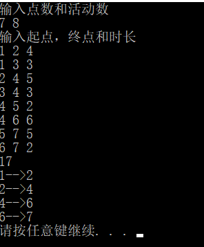
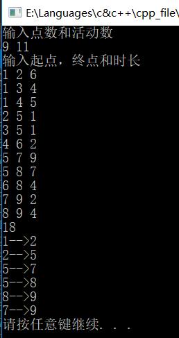
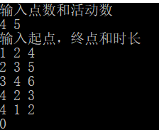

# 数据结构课程设计

#### 作者：1651718 方沛

[TOC]

## 关键活动项目说明文档

### 0.项目简介
本实验项目是要求在任务调度问题中，如果还给出了完成每个字任务需要的时间，则可以算出完成整个工程项目需要的最短时间。在这些子任务中，有些任务即使推迟几天完成，也不会影响全局的工期；但是有些任务必须准时完成，否则整个项目的工期就要因此而延误，这些任务叫做“关键活动”。
请编写程序判定一个给定的工程项目的任务调度是否可行；如果该调度方案可行，则计算完成整个项目需要的最短时间，并且输出所有的关键活动。

- 项目功能要求：
1. 输入说明：输入第1行给出两个正整数N（N《=100）和M，其中N是任务交接点（即衔接两个项目依赖的两个子任务的结点，例如：若任务2要在任务1完成后才开始，则两个任务之间必有一个交接点）的数量，交接点按1～N编号，M是字任务的数量，依次编号为1～M。随后M行，每行给出3个正整数，分别是该任务开始和完成设计的交接点编号以及完成该任务所需要的时间，整数间用空格分隔。
2. 输出说明：如果任务调度不可行，则输出0；否则第一行输出完成整个项目所需要的时间，第2行开始输出所有关键活动，每个关键活动占一行，按照格式“v->W”输出，其中V和W为该任务开始和完成涉及的交接点编号。关键活动输出的顺序规则是：任务开始的交接点编号小者优先，起点编号相同时，与输入时任务的顺序相反。如下面测试用例2中，任务<5，7>先于任务<5，8>输入，而作为关键活动输出时则次序相反。

### 1.核心代码

#### 解释说明
** 先做一次拓扑排序（计算入度），拓扑顺序存在各个节点的data域里。建立一个map，将拓扑顺序与索引相对应。然后按照拓扑顺序求出各个活动最晚开始时间，按照拓扑逆序求出各个活动最早结束时间。最终根据Ve,Vl求出Ae,A，进而求出关键活动。 **

#### 源代码
```c++
void Graph::TopologicalSort() {
	Graph::findZero();
	int count = 0;
	while (!InZeroPoints.empty()) {
		int temp = InZeroPoints.top();
		InZeroPoints.pop();
		SortResults.push_back(temp);
		count++;
		if (!links[temp].empty()) {
			for (auto t = links[temp].begin(); t != links[temp].end(); t++) {
					InCounts[t->bkdest()]--;
			}
		}
		Graph::findZero();
	}
}
void Graph::findCriticalPaths(){
	//逆拓扑有序
	Graph::TopologicalSort();
	int *Ve = new int[vertex + 1];
	memset(Ve, 0, sizeof(int)*(vertex + 1));
	int *Vl = new int[vertex + 1];
	for (int i = 1; i < SortResults.size(); i++) {
		int anc = SortResults[i];
		for (auto t = links[anc].begin(); t != links[anc].end(); t++) {
			if (Ve[anc] + t->bkspan() > Ve[t->bkdest()]) {
				Ve[t->bkdest()] = t->bkspan() + Ve[anc];
			}
		}
	}
	//初始化
	for (int i = 0; i < vertex + 1; i++) {
		Vl[i] = INT_MAX;
	}
	int *Vo = new int[vertex + 1];
	memset(Vo, 0, sizeof(int)*(vertex + 1));
	Vl[SortResults[SortResults.size()-1]] = Ve[SortResults[SortResults.size() - 1]];
	//一一遍历
	for (int i = SortResults.size() - 1; i > 0; i--) {
		int anc = SortResults[i];//开始的点的序号
		for (auto t = links.begin(); t != links.end(); t++) {
			for (auto k = t->second.begin(); k != t->second.end(); k++) {
				//如果能找到入anc的点
				if (k->bkdest() == anc) {
					if (Vo[anc] + k->bkspan() > Vo[t->first]) {
						Vo[t->first] = Vo[anc] + k->bkspan();
						Vl[t->first] = Vl[SortResults[SortResults.size() - 1]] - Vo[t->first];
					}
				}
			}
		}
	}
	int * Ae = new int[edge + 1];
	memset(Ae, 0, sizeof(int)*(edge + 1));
	int * Al = new int[edge + 1];
	memset(Ae, 0, sizeof(int)*(edge + 1));
	//扫描领接表
	queue<Edge> StepsDisplay; int sum = 0;
	for (int i = 1; i < SortResults.size(); i++) {
		for (auto t = links[SortResults[i]].begin(); t != links[SortResults[i]].end(); t++) {
			int ae = Ve[SortResults[i]];
			int al = Vl[t->bkdest()] - t->bkspan();
			if (ae == al) {
				sum = sum + t->bkspan();
				StepsDisplay.push(Edge(SortResults[i], t->bkdest(), t->bkspan()));
			} 
		}
	}
	cout << sum << endl;
	while (!StepsDisplay.empty()) {
		Edge temp = StepsDisplay.front();
		StepsDisplay.pop();
		cout << temp.bg_point << "-->" << temp.ed_point << endl;
	}
	delete[]Vl,Vo,Ve,Ae,Al;
}

```
### 2.项目效果
- 简单情况测试


- 一般情况测试，单个起点和单个终点


- 不可行的方案测试



### 2. 类及类成员介绍

- #### Edge类  
  - ##### 成员变量
  | 成员名称 | 属性   | 类型       | 描述               |
  | -------- | ------ | ---------- | ------------------ |
  | bg_point | public | int        | 边的一个顶点           |
  | ed_point | public | int | 边的另一个顶点 |
  | length  | public | int | 边的权重 |

  - ##### 成员函数  
  | 函数名称 | 返回值类型 | 描述     |
  | -------- | ---------- | -------- |
  | Edge | 无         | 构造函数 |

- #### NodeRear类
  - ##### 成员变量
  | 成员名称 | 属性   | 类型       | 描述               |
  | -------- | ------ | ---------- | ------------------ |
  | dest | private | int        | 边的终止节点      |
  | span | private | int  | 边的权重 |
  - ##### 成员函数  
  | 函数名称 | 返回值类型 | 描述     |
  | -------- | ---------- | -------- |
  | NodeRear | 无         | 构造函数 |


- #### Graph类 （有向图）

  - ##### 成员变量
  | 成员名称 | 属性   | 类型       | 描述               |
  | -------- | ------ | ---------- | ------------------ |
  | edge | private | int        | 节点个数          |
  | vertex | private | int        | 边的个数          |
  | links     | private | map<int, list<NodeRear>> | 表示图的邻接表    |
  | InCounts | private | vector<int> |入度数组           |
  | SortResults | private | vector<int> | 拓扑排序结果储存 |
  | InZeroPoints | private | stack<int> | 储存入度为0的栈 |

  - ##### 成员函数  
  | 函数名称 | 参数 | 返回值 | 描述     |
  | -------- | -------- | ---------- | -------- |
  |Graph| int,int | void   | 构造函数 |
  | append | int,int,int | void   | 增加一条边 |
  | findZero | void | void      | 寻找入度为0的边 |
  | TopologicalSort | void | void         | 拓扑排序 |
  | findCriticalPaths | void | void         | 寻找关键路径 |

### 3.类的实现
- #### Edge类的实现

```c++
class Edge {
public:
	int bg_point=0;
	int ed_point=0;
	int length=0;
	Edge(int _bg, int _ed, int _lg) :bg_point(_bg), ed_point(_ed), length(_lg) {};
};
```
- #### NodeRear类的实现

```c++
class NodeRear {
private:
	int dest = 0;
	int span = 0;
public:
	NodeRear(int _dest, int _span) :dest(_dest), span(_span) {};
	int bkdest() { return dest; };
	int bkspan() { return span; };
};
```

- #### Graph类的实现（有向图）

- ##### findCriticalPath说明
先进行拓扑排序,按照拓扑排序顺序一一更新Ve,Vl,Ae,Al,值得注意的是,不同于书上邻接矩阵的实现方式,邻接表在求反向Ve时代码会复杂一些,我在这里没有选择建立逆邻接表的方式,而是选择了从尾部到头部反向遍历.最后Ae和Al相等的路径就是关键路径,路程长实际上是Ve.
```c++
class Graph {
private:
	int edge = 0;
	int vertex = 0;
	map<int, list<NodeRear>> links;
	vector<int> InCounts;//入度对照
	vector<int> SortResults;//拓扑排序结果储存
	stack<int> InZeroPoints;//存储入度为0的边的栈

public:
	Graph(int n,int m);
	void append(int _start, int _end, int _span);
	void findZero();
	void findCriticalPaths();
	void TopologicalSort();
};
void Graph::append(int _start, int _end, int _span) {
	links[_start].push_back(NodeRear(_end, _span));
	InCounts[_end]++;
}
Graph::Graph(int n,int m) {
	vertex = n; edge = m;
	InCounts.push_back(0);
	SortResults.push_back(-1);//挤掉第一个下标
	for (int i = 1; i <= n; i++) {
		list<NodeRear> temp;
		links[i] = temp;
		InCounts.push_back(0);
	}
}
void Graph::findZero() {
	for (int i = 1; i < InCounts.size(); i++) {
		//把入度为0的顶点全部压入栈中
		if (InCounts[i] == 0) {
			InZeroPoints.push(i);
			InCounts[i]--;
		}
	}
}
void Graph::TopologicalSort() {
	Graph::findZero();
	int count = 0;
	while (!InZeroPoints.empty()) {
		int temp = InZeroPoints.top();
		InZeroPoints.pop();
		SortResults.push_back(temp);
		count++;
		if (!links[temp].empty()) {
			for (auto t = links[temp].begin(); t != links[temp].end(); t++) {
					InCounts[t->bkdest()]--;
			}
		}
		Graph::findZero();
	}
}

void Graph::findCriticalPaths(){
	//逆拓扑有序
	Graph::TopologicalSort();
	int *Ve = new int[vertex + 1];
	memset(Ve, 0, sizeof(int)*(vertex + 1));
	int *Vl = new int[vertex + 1];
	for (int i = 1; i < SortResults.size(); i++) {
		int anc = SortResults[i];
		for (auto t = links[anc].begin(); t != links[anc].end(); t++) {
			if (Ve[anc] + t->bkspan() > Ve[t->bkdest()]) {
				Ve[t->bkdest()] = t->bkspan() + Ve[anc];
			}
		}
	}
	//初始化
	for (int i = 0; i < vertex + 1; i++) {
		Vl[i] = INT_MAX;
	}
	int *Vo = new int[vertex + 1];
	memset(Vo, 0, sizeof(int)*(vertex + 1));
	Vl[SortResults[SortResults.size()-1]] = Ve[SortResults[SortResults.size() - 1]];
	//一一遍历
	for (int i = SortResults.size() - 1; i > 0; i--) {
		int anc = SortResults[i];//开始的点的序号
		for (auto t = links.begin(); t != links.end(); t++) {
			for (auto k = t->second.begin(); k != t->second.end(); k++) {
				//如果能找到入anc的点
				if (k->bkdest() == anc) {
					if (Vo[anc] + k->bkspan() > Vo[t->first]) {
						Vo[t->first] = Vo[anc] + k->bkspan();
						Vl[t->first] = Vl[SortResults[SortResults.size() - 1]] - Vo[t->first];
					}
				}
			}
		}
	}
	int * Ae = new int[edge + 1];
	memset(Ae, 0, sizeof(int)*(edge + 1));
	int * Al = new int[edge + 1];
	memset(Ae, 0, sizeof(int)*(edge + 1));
	//扫描领接表
	queue<Edge> StepsDisplay;
	for (int i = 1; i < SortResults.size(); i++) {
		for (auto t = links[SortResults[i]].begin(); t != links[SortResults[i]].end(); t++) {
			int ae = Ve[SortResults[i]];
			int al = Vl[t->bkdest()] - t->bkspan();
			if (ae == al) {
				StepsDisplay.push(Edge(SortResults[i], t->bkdest(), t->bkspan()));
			} 
		}
	}
	if (SortResults.size() > 1) {
		cout << Ve[SortResults[SortResults.size() - 1]] << endl;
	}
	else {
		cout << 0 << endl;
	}
	while (!StepsDisplay.empty()) {
		Edge temp = StepsDisplay.front();
		StepsDisplay.pop();
		cout << temp.bg_point << "-->" << temp.ed_point << endl;
	}
	delete[]Vl,Vo,Ve,Ae,Al;
}
```

### 4.CentOS7编译
- g++中memset定义在<string.h>中,要把<string>改成<string.h>
- g++中没有INT_MAX 需要自行define 一个
